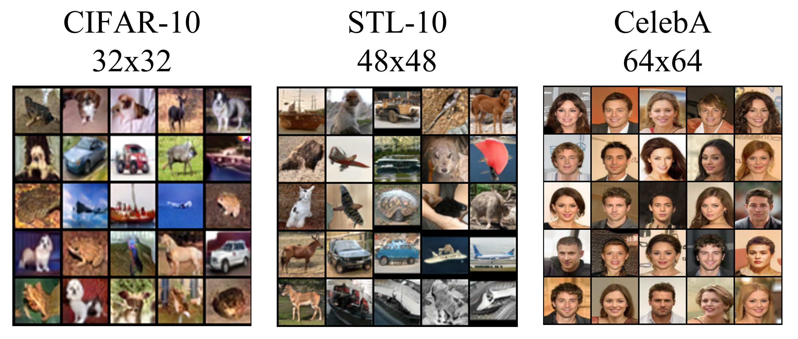
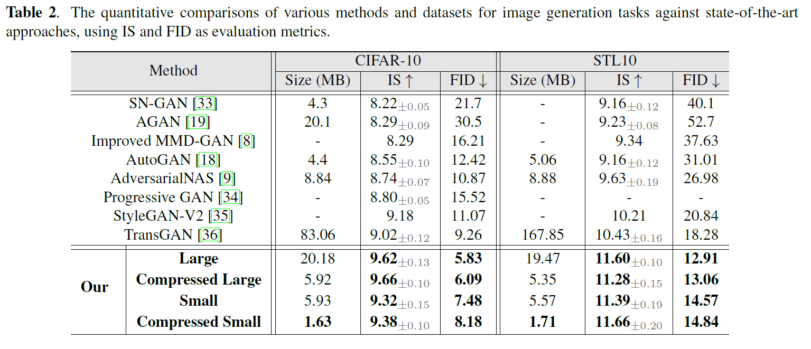
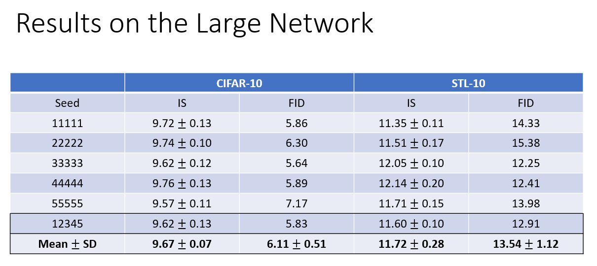

# ENHANCING GAN PERFORMANCE THROUGH NEURAL ARCHITECTURE SEARCH AND TENSOR DECOMPOSITION (MMD-AdversarialNAS)

## Qualitative Results

## Quantitative Results

## Repeatability

## Getting Started
### Installation
1. Clone this repository.

    ~~~
    git clone https://github.com/PrasannaPulakurthi/MMD-AdversarialNAS.git
    ~~~
   
2. Install Pytorch, Tensorflow, CUDA, and requirements.

    ~~~
    pip install -r requirements.txt
    ~~~
    
### Preparing necessary files

Files can be found in [Google Drive](https://drive.google.com/drive/folders/1xB6Y-btreBtyVZ-kdGTIZgLTjsv7H4Pd?usp=sharing).

1. Download the pre-trained models to ./exps
    
2. Download the pre-calculated statistics to ./fid_stat for calculating the FID.

## Instructions for Testing, Training, Searching, and Compressing the Model.
### Testing
1. Download the trained generative models [Google Drive](https://drive.google.com/drive/folders/1xB6Y-btreBtyVZ-kdGTIZgLTjsv7H4Pd?usp=sharing) to ./exps/arch_train_cifar10_large/Model

    ~~~
    mkdir -p exps/arch_train_cifar10_large/Model
    ~~~
   
2. To test the trained model, run the command found in scripts/test_arch_cifar10.sh
   
    ~~~
    python MGPU_test_arch.py --gpu_ids 0 --num_workers 8 --dataset cifar10 --bottom_width 4 --img_size 32 --arch arch_cifar10 --draw_arch False --checkpoint arch_train_cifar10_large --genotypes_exp arch_cifar10 --latent_dim 120 --gf_dim 256 --num_eval_imgs 50000 --eval_batch_size 100 --exp_name arch_test_cifar10_large
    ~~~

### Training
1. Train the weights of the generative model with the searched architecture (the architecture is saved in ./exps/arch_cifar10/Genotypes/latest_G.npy). Run the command found in scripts/train_arch_cifar10_large.sh
   
    ~~~
    python MGPU_train_arch.py --gpu_ids 0 --num_workers 8 --gen_bs 128 --dis_bs 128 --dataset cifar10 --bottom_width 4 --img_size 32 --max_epoch_G 500 --n_critic 1 --arch arch_cifar10 --draw_arch False --genotypes_exp arch_cifar10 --latent_dim 120 --gf_dim 256 --df_dim 512 --g_lr 0.0002 --d_lr 0.0002 --beta1 0.0 --beta2 0.9 --init_type xavier_uniform --val_freq 5 --num_eval_imgs 50000 --exp_name arch_train_cifar10_large
    ~~~

### Searching the Architecture

1. To use AdversarialNAS to search for the best architecture, run the command found in scripts/search_arch_cifar10.sh
   
    ~~~
    python MGPU_search_arch.py --gpu_ids 0 --gen_bs 128 --dis_bs 128 --dataset cifar10 --bottom_width 4 --img_size 32 --max_epoch_G 25 --arch search_both_cifar10 --latent_dim 120 --gf_dim 160 --df_dim 80 --g_spectral_norm False --d_spectral_norm True --g_lr 0.0002 --d_lr 0.0002 --beta1 0.0 --beta2 0.9 --init_type xavier_uniform --n_critic 5 --val_freq 5 --derive_freq 1 --derive_per_epoch 16 --draw_arch False --exp_name search/bs120-dim160 --num_workers 8 --gumbel_softmax True
    ~~~
    
### Compression
1. Compress and Finetune all the Convolutional Layers except 9 and 13.
   
    ~~~
    python MGPU_cpcompress_arch.py --gpu_ids 0 --num_workers 8 --dataset cifar10 --bottom_width 4 --img_size 32 --arch arch_cifar10 --draw_arch False --genotypes_exp arch_cifar10  --latent_dim 120 --gf_dim 256 --df_dim 512 --num_eval_imgs 50000 --eval_batch_size 100 --checkpoint arch_train_cifar10_large  --exp_name compress_train_cifar10_large --val_freq 5  --gen_bs  128 --dis_bs 128 --beta1 0.0 --beta2 0.9  --byrank --rank 256 --layers cell1.c0.ops.0.op.1 cell1.c1.ops.0.op.1 cell1.c2.ops.0.op.1 cell1.c3.ops.0.op.1 cell2.c0.ops.0.op.1 cell2.c2.ops.0.op.1 cell2.c3.ops.0.op.1 cell2.c4.ops.0.op.1 cell3.c1.ops.0.op.1 cell3.c2.ops.0.op.1 cell3.c3.ops.0.op.1 --compress-mode "allatonce" --max_epoch_G 500 --eval_before_compression
    ~~~
    
2. Compress the Fully Connected Layers except l1.

    ~~~
    python MGPU_cpcompress_arch.py --gpu_ids 0 --num_workers 8 --dataset cifar10 --bottom_width 4 --img_size 32 --arch arch_cifar10 --draw_arch False --genotypes_exp arch_cifar10  --latent_dim 120 --gf_dim 256 --df_dim 512 --num_eval_imgs 50000 --eval_batch_size 100 --checkpoint compress_train_cifar10_large  --exp_name compress_train_cifar10_large --val_freq 5  --gen_bs  128 --dis_bs 128 --beta1 0.0 --beta2 0.9  --byrank --rank 4 --layers l2 l3 --freeze_layers l2 l3 --compress-mode "allatonce" --max_epoch_G 1 --eval_before_compression
    ~~~
       
5. To Test the compressed network, download the compressed model from [Google Drive](https://drive.google.com/drive/folders/1xB6Y-btreBtyVZ-kdGTIZgLTjsv7H4Pd?usp=sharing) to ./exps/compress_train_cifar10_large/Model

    ~~~
    python MGPU_test_cpcompress.py --gpu_ids 0 --num_workers 8 --dataset cifar10 --bottom_width 4 --img_size 32 --arch arch_cifar10 --draw_arch False --checkpoint compress_train_cifar10_large --genotypes_exp arch_cifar10 --latent_dim 120 --gf_dim 256 --num_eval_imgs 50000 --eval_batch_size 100 --exp_name compress_test_cifar10_large  --byrank
    ~~~

## Acknowledgement
Codebase from [AdversarialNAS](https://github.com/chengaopro/AdversarialNAS), [TransGAN](https://github.com/VITA-Group/TransGAN), and [Tensorly](https://github.com/tensorly/tensorly).
