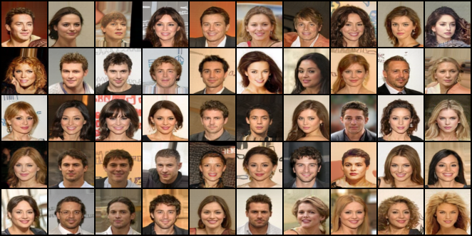

# MMD-AdversarialNAS

## Representative Visual Results

## Getting Started
### Installation
1. Clone this repository.

    ~~~
    git clone https://github.com/PrasannaPulakurthi/MMD-AdversarialNAS.git
    ~~~
   
2. Install Pytorch, Tensorflow 1, CUDA, and requirements.

    ~~~
    pip install -r requirements.txt
    ~~~
    
### Preparing necessary files

Files can be found in [Google Drive](https://drive.google.com/drive/folders/1xB6Y-btreBtyVZ-kdGTIZgLTjsv7H4Pd?usp=sharing).

1. Download the pre-trained models to ./exps
    
2. Download the pre-calculated statistics to ./fid_stat for calculating the FID.

## Instructions for Testing, Training, and Searching the Model.
### Testing
1. Download the trained generative models [Google Drive](https://drive.google.com/drive/folders/1xB6Y-btreBtyVZ-kdGTIZgLTjsv7H4Pd?usp=sharing) to ./exps/arch_train_cifar10/Model

    ~~~
    mkdir -p exps/arch_train_cifar10/Model
    ~~~
   
2. To test the trained model run the command found in scripts/test_arch_cifar10.sh
    ~~~
    python MGPU_test_arch.py --gpu_ids 0 --num_workers 8 --dataset cifar10 --bottom_width 4 --img_size 32 --arch arch_cifar10 --draw_arch True --checkpoint arch_train_cifar10 --genotypes_exp arch_cifar10 --latent_dim 120 --gf_dim 256 --df_dim 512 --num_eval_imgs 50000 --eval_batch_size 100 --exp_name arch_test_cifar10
    ~~~

### Training
1. Train the weights of generative model with the searched architecture (the architecture is saved in ./exps/arch_cifar10/Genotypes/latest_G.npy). Run the command found in scripts/train_arch_cifar10.sh
    ~~~
    python MGPU_train_arch.py --gpu_ids 0 --num_workers 8 --gen_bs 40 --dis_bs 80 --dataset cifar10 --bottom_width 4 --img_size 32 --max_epoch_G 200 --n_critic 5 --arch arch_cifar10 --draw_arch True --genotypes_exp arch_cifar10 --latent_dim 120 --gf_dim 256 --df_dim 512 --g_lr 0.0002 --d_lr 0.0002 --beta1 0.0 --beta2 0.9 --init_type xavier_uniform --val_freq 5 --num_eval_imgs 50000 --exp_name arch_train_cifar10
    ~~~

### Searching the Architecture

1. To use AdversarialNAS to search for the best architecture run the command found in scripts/search_arch_cifar10.sh
    ~~~
    python MGPU_search_arch.py --gpu_ids 0 --gen_bs 120 --dis_bs 120 --dataset cifar10 --bottom_width 4 --img_size 32 --max_epoch_G 5 --arch search_both_cifar10 --latent_dim 120 --gf_dim 160 --df_dim 80 --g_spectral_norm False --d_spectral_norm True --g_lr 0.0002 --d_lr 0.0002 --beta1 0.0 --beta2 0.9 --init_type xavier_uniform --n_critic 5 --val_freq 5 --derive_freq 1 --derive_per_epoch 16 --draw_arch False --exp_name search/bs120-dim160 --num_workers 8 --gumbel_softmax True
    ~~~

## Acknowledgement
Codebase from [AdversarialNAS](https://github.com/chengaopro/AdversarialNAS), [TransGAN](https://github.com/VITA-Group/TransGAN)
